# Bleya 🚀

# Bleya Logo

## Sobre a Bleya 🏆

A Bleya é uma empresa inovadora no mercado de desenvolvimento web e tecnologia, dedicada à criação de novos sites e tecnologias para facilitar a vida das pessoas. Nossa missão é transformar ideias em realidade digital, proporcionando soluções modernas, eficientes e personalizadas.

## O que fazemos? 💡

Na Bleya, acreditamos que a tecnologia pode mudar o mundo. Por isso, trabalhamos com:

- 🌍 **Criação de sites responsivos e dinâmicos**
- 🖌️ **Design inovador e interativo**
- ⚙️ **Desenvolvimento de aplicações web otimizadas**
- 🚀 **Tecnologias emergentes para facilitar a vida das pessoas**

## Como atuamos no mercado? 📈

A Bleya se destaca por estar sempre à frente das inovações tecnológicas, buscando oferecer as melhores ferramentas e serviços para empresas e indivíduos. Nosso objetivo é criar soluções personalizadas que atendam às necessidades do cliente, sempre prezando pela qualidade, usabilidade e performance.

## Nossa Visão 🌟

Ser referência no desenvolvimento de tecnologias inovadoras, promovendo a evolução digital e impactando positivamente a vida das pessoas através da programação.

## Projetos Recentes

Nos últimos 2 meses, concluímos com sucesso 10 projetos para diversos clientes:

```mermaid
graph TD;
    title[Projetos Concluídos nos Últimos 2 Meses]
    style title fill:none,stroke:none
    
    subgraph Abril
    A1[E-commerce de Moda] --> A2[Blog Corporativo]
    A2 --> A3[Landing Page SaaS]
    A3 --> A4[Portal de Notícias]
    end
    
    subgraph Maio
    M1[Aplicação Web Financeira] --> M2[Site Institucional]
    M2 --> M3[Plataforma Educacional]
    M3 --> M4[Marketplace]
    M4 --> M5[Dashboard Analítico]
    M5 --> M6[Rede Social Temática]
    end
    
    classDef abril fill:#a855f7,color:white,stroke:#9333ea;
    classDef maio fill:#06b6d4,color:white,stroke:#0891b2;
    
    class A1,A2,A3,A4 abril;
    class M1,M2,M3,M4,M5,M6 maio;
```

## Tecnologias que utilizamos

- React.js
- Next.js
- TypeScript
- Tailwind CSS
- Node.js
- Express
- MongoDB

## Entre em contato 📞

Se você deseja conhecer mais sobre nossos projetos ou quer transformar sua ideia em realidade, entre em contato conosco:

- ✉️ **Email**: eurael30215@gmail.com
- 🌐 **Site**: [Bleya](https://bleya.netlify.app/)
- 📱 **Redes Sociais**: Em breve!

---

### 💻 Bleya - Criando o futuro da tecnologia, um site de cada vez! 🚀
